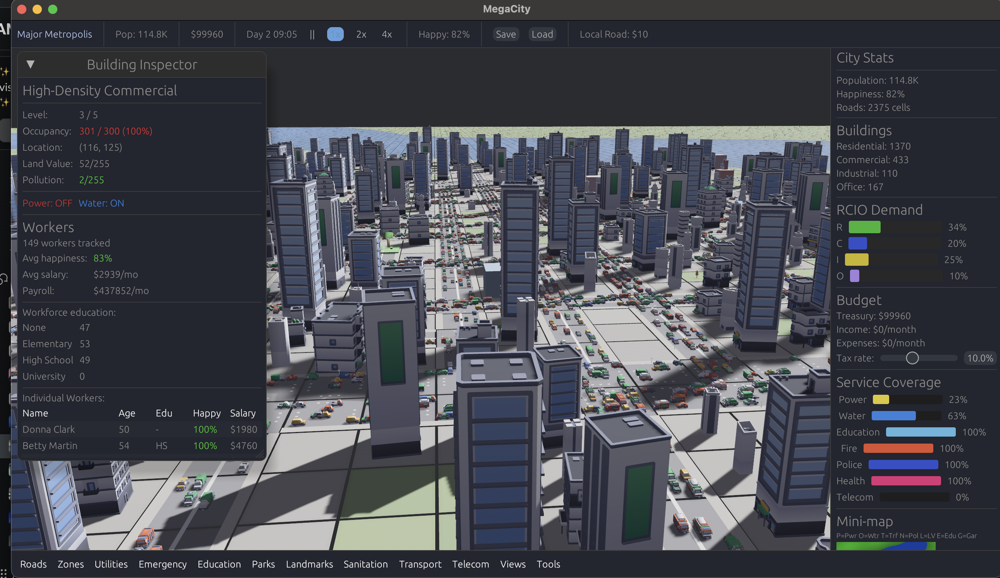
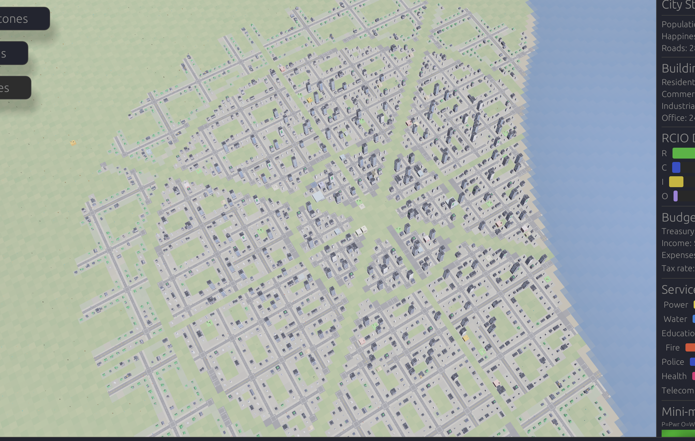
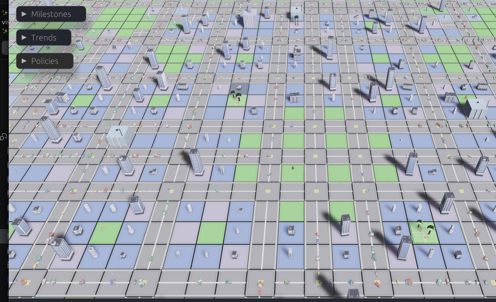

# Megacity

A deep city builder simulation built with [Bevy](https://bevyengine.org/) (Rust ECS game engine). Simulates a living city with 10,000+ individually tracked citizens who commute, work, age, marry, and respond to the urban environment you create — scaling to 1M+ via a virtual population LOD system.

Playable natively on macOS, Linux, and Windows, or [in the browser via WebAssembly](https://dzautner.github.io/megacity/).








## Features

### Citizens & Demographics
- **Individual agent simulation** — each citizen tracks age, gender, education level, personality traits, health, happiness, savings, and needs
- **State machine movement** — citizens commute home-to-work along Bezier-curve road paths with activities at each location
- **Full life events** — aging, education advancement, job seeking, marriage, children, retirement, death
- **LOD scaling** — Full/Simplified/Abstract tiers with a virtual population layer so ~10K tracked entities represent 1M+ simulated citizens
- **Immigration & emigration** driven by city attractiveness (jobs, housing, happiness, services)
- **Homelessness & welfare** systems with social service buildings
- **Disease model** — illness spreading through the population based on health infrastructure coverage

### Zoning & Buildings
- **6 zone types**: Residential Low/High, Commercial Low/High, Industrial, and Office — plus Mixed-Use
- **Building lifecycle** — construction phase, upgrades (up to level 5), abandonment, and demolition
- **Form-based zoning** — cumulative zoning, inclusionary zoning (affordable housing mandates), FAR transfer, historic preservation districts
- **Districts** with per-district statistics, policy overrides, and neighborhood quality scoring
- **Superblocks** — car-free pedestrian zones with policy effects on walkability and happiness

### Transportation
- **Bezier curve road segments** — smooth roads with Local, Avenue, Boulevard, Highway, Path, and One-Way types
- **CSR graph pathfinding** — A* routing on a compressed sparse row graph built from road segments, with traffic-aware cost functions
- **Traffic simulation** — density modeling, congestion propagation, level-of-service grading, and traffic accidents
- **Public transit** — bus routes, tram lines, metro systems, and train networks with transit hubs
- **Road tools** — freehand drawing, curve drawing, auto-grid placement, parallel snap, roundabout builder
- **Road maintenance** — degradation from traffic volume, repair budgets, condition tracking
- **Bicycle lanes** and walkability scoring
- **Freight traffic** from industrial production chains
- **Airport** with outside connections for tourism and trade

### Economy & Budget
- **Per-zone tax collection** — independent residential, commercial, industrial, and office tax rates
- **City budget** with treasury, income tracking, and per-category expenditure breakdowns
- **Loan system** with credit ratings, variable interest rates, and bankruptcy game-over
- **Production chains** — industrial buildings produce goods, market prices fluctuate with supply/demand
- **Import/export trade** via outside connections (road, rail, airport, port)
- **Wealth distribution** tracked across the population
- **City specializations** computed from economic mix (industrial hub, tech center, tourist destination, etc.)
- **Hope & Discontent** dual meters reflecting citizen morale

### Services & Infrastructure
- **Power grid** — coal, gas, nuclear, solar, wind, hydro, geothermal, biomass, waste-to-energy plants with battery storage, demand response, time-of-use pricing, power line transmission, maintenance schedules, and blackout events
- **Water system** — pipe networks, water pressure simulation, treatment plants, conservation policies, groundwater modeling with depletion
- **District heating** — combined heat & power from thermal plants, heating service coverage, degree-day calculations
- **Fire system** — random fires, fire spread to forests, tiered fire stations, service vehicle dispatch
- **Crime & justice** — crime simulation with tiered police coverage
- **Health** — hospitals, disease model, pollution health effects
- **Education** — elementary schools, high schools, universities, campus districts with education pipeline
- **Death care** — crematoriums and cemeteries with capacity tracking
- **Garbage** — collection routing, waste composition, recycling, composting, hazardous waste, landfills with gas emissions, waste-to-energy, and waste reduction policies
- **Parks** — park districts with leveling system, cultural buildings with prestige
- **Postal & telecom** coverage networks
- **Service vehicle dispatch** on the road network with capacity limits and staffing

### Environment & Climate
- **Weather system** — temperature, precipitation, wind speed/direction, seasonal cycles
- **Climate events** — droughts, heat waves, cold snaps with gameplay consequences
- **Climate change** — long-term temperature trends affecting energy demand and disasters
- **Air pollution** — grid-based dispersion from industrial zones, traffic emissions, heating, and airports, with wind-aware Gaussian plume modeling
- **Noise pollution** — complete source type table (roads, industry, airports) with noise barriers
- **Water pollution** — sources, treatment, quality effects on health
- **Soil contamination** — persistence model with remediation mechanics
- **Groundwater** — aquifer simulation with quality tracking and depletion
- **Land value** grid influenced by services, pollution, proximity, and neighborhood quality
- **Trees** — forest system with environmental absorption effects, vulnerable to forest fires
- **Urban heat island** effect with mitigation strategies (green roofs, reflective surfaces)
- **Procedural terrain** — FBM noise-based generation with coastlines and rivers
- **Stormwater & flooding** — storm drainage, combined sewer overflows, flood simulation with protection infrastructure
- **Environmental score** — aggregate sustainability metric

### Disasters & Events
- **Natural disasters** — earthquakes with structural damage, flooding
- **Forest fires** spreading from urban fires to tree areas
- **Emergency management** response system
- **Random city events** with active effects on the simulation
- **Notification system** with event journal

### Progression & Gameplay
- **Unlocks & milestones** — development points progression system
- **Achievement tracking**
- **Advisor panel** with contextual suggestions
- **Tutorial system** with progressive UX hints
- **Save/load** — bitcode serialization with file versioning, migration system, crash recovery, multiple save slots, autosave, and quick-save/quick-load hotkeys
- **Undo/redo** for building actions
- **Blueprints** — save and reuse building layouts
- **Dynamic music** — mood-based soundtrack that responds to city state
- **Ambient soundscape** — background city audio
- **Colorblind mode** and customizable keybindings

## Architecture

```
crates/
  app/          Entry point — window setup, asset loading, platform init (native + WASM)
  simulation/   All game logic — 235 feature plugins across 180 modules
  rendering/    Bevy rendering — terrain, roads, buildings, overlays, camera, effects
  ui/           egui-based UI — toolbar, info panels, dashboards, menus, settings
  save/         Persistence — bitcode serialization, versioning, migration, crash recovery
  automod_dir/  Proc macro for zero-conflict module auto-discovery
```

### Simulation

The simulation runs on a **fixed 10Hz timestep** (`FixedUpdate`). The world is a **256x256 cell grid** (CELL_SIZE=16.0, 4096x4096 world units) divided into 8x8 chunks for spatial queries. Rendering runs at full frame rate with LOD-based culling.

Road geometry uses **cubic Bezier curves** stored in `RoadSegmentStore` (source of truth), rasterized to the grid for cell-level queries, and indexed in a **CSR graph** for A* pathfinding with traffic-aware cost functions.

The simulation is **fully deterministic** — a ChaCha8 RNG seeded per game ensures identical state across runs, enabling replay verification and competitive seeds.

### Plugin Architecture

Every feature is a self-contained Bevy plugin:

```rust
pub struct MyFeaturePlugin;

impl Plugin for MyFeaturePlugin {
    fn build(&self, app: &mut App) {
        app.init_resource::<MyState>();
        app.add_systems(FixedUpdate, my_system.in_set(SimulationSet::Simulation));
    }
}
```

Modules are **auto-discovered** at compile time via `automod_dir::dir!()` — creating a new `.rs` file automatically includes it as a module with no `lib.rs` edits needed. Plugin registration is one line per plugin in `plugin_registration.rs`. This design supports dozens of contributors working in parallel with near-zero merge conflicts.

### Save System

Features opt into persistence by implementing a `Saveable` trait:

```rust
impl Saveable for MyState {
    const SAVE_KEY: &'static str = "my_feature";
    fn save_to_bytes(&self) -> Option<Vec<u8>> { ... }
    fn load_from_bytes(bytes: &[u8]) -> Self { ... }
}
```

Saveable state is stored in an extension map inside save files — new features never need to modify the core save code. Save files include version headers with automatic migration for backwards compatibility.

### Testing

244 integration test files use a `TestCity` builder for headless Bevy App tests:

```rust
#[test]
fn test_residential_tax_affects_income() {
    let mut city = TestCity::new()
        .with_road_line((100, 128), (156, 128), RoadType::Avenue)
        .with_zone_rect((101, 129), (110, 135), ZoneType::ResidentialLow)
        .with_starting_treasury(50_000.0);
    city.tick_slow_cycles(2);
    assert!(city.app.world().resource::<CityBudget>().income > 0.0);
}
```

6 benchmark suites (Criterion.rs) track performance for simulation ticks, pathfinding, grid operations, traffic, serialization, and frame rendering.

## Building & Running

Requires Rust (stable) and system dependencies for Bevy:

```bash
# macOS
brew install cmake

# Ubuntu/Debian
sudo apt-get install -y libasound2-dev libudev-dev pkg-config libwayland-dev

# Build and run
cargo run --release -p app
```

### WASM (browser)

```bash
# Install trunk
cargo install trunk

# Build and serve
trunk serve --release
```

#### Web Replay Viewer (watch-only)

Browser replay mode is enabled with a `replay` query parameter:

```text
http://localhost:8080/?replay=assets/replays/<file>.replay
```

In replay viewer mode:
- camera movement/zoom still works
- build/edit gameplay input is disabled
- a minimal top control bar provides play/pause, speed (1x/2x/4x), progress, and reload

Prepare replay assets for web playback:

```bash
python3 scripts/prepare_web_replays.py \
  --inputs sessions/<run1>.replay sessions/<run2>.replay \
  --output-dir crates/app/assets/replays \
  --target-end-tick 1800
```

This repository includes prepared examples in `crates/app/assets/replays/`:
- `nemotron-3-nano-30b-a3b_free_42_1772286545.web_x42.replay`
- `nemotron-3-nano-30b-a3b_free_42_1772285791.web_x26.replay`
- `nemotron-3-nano-30b-a3b_free_42_1772284935.web_x15.replay`

### Development

```bash
cargo build --workspace        # Build all crates
cargo test --workspace         # Run all tests
cargo clippy --workspace -- -D warnings  # Lint
cargo fmt --all                # Format
```

## License

All rights reserved.
